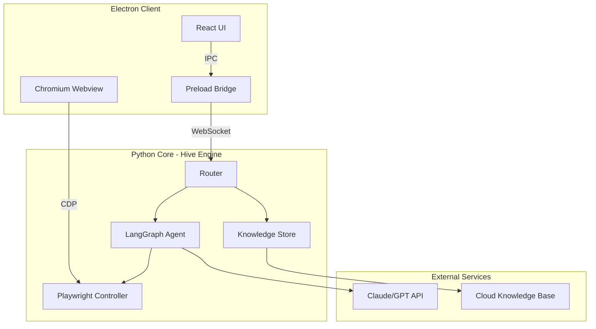
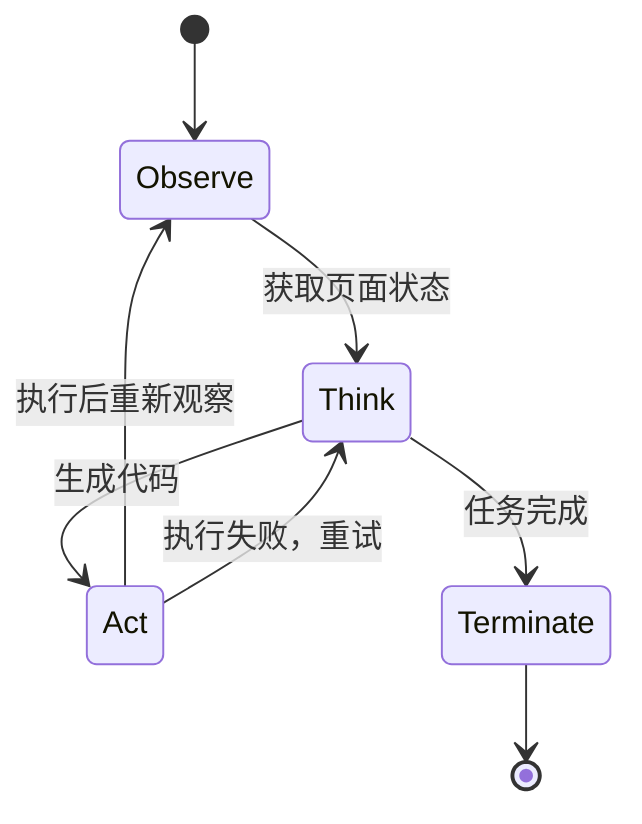
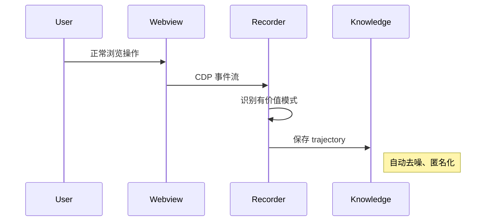
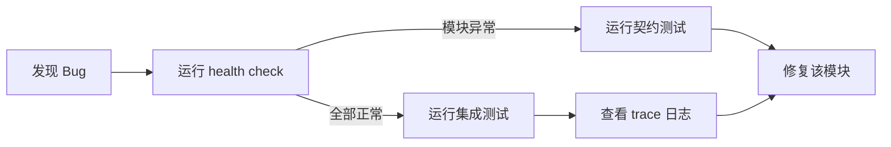

# NogicOS 顶级 AI 浏览器架构方案

---

## 核心价值定位

**"用的人越多，所有人越快"** - 通过共享知识库实现网络效应竞品对比（2025）：

- browser-use：Agent 框架，无桌面客户端，无知识共享
- OpenAI Operator：闭源，无知识积累
- Arc/Dia：浏览器优先，AI 辅助，非 Agent 驱动

**NogicOS 差异化**：

1. 被动学习 - 用户操作即训练数据
2. 知识共享 - 全网用户共建知识库
3. 桌面客户端 - 真正的浏览器体验

---

## 系统架构



---

## 技术选型（2025 最佳实践）

### 前端 - Electron Desktop

| 层级 | 技术 | 理由 ||------|------|------|| 框架 | **Electron 33** + Vite | 最新稳定版，热更新 || UI | **React 19** + TypeScript | 组件化，类型安全 || 样式 | **Tailwind CSS v4** | 原子化，高性能 || 状态 | **Zustand** | 轻量，无样板代码 || IPC | **electron-trpc** | 类型安全的进程通信 |关键架构决策：

- 使用 `<webview>` 标签而非 BrowserView（更好的隔离）
- Preload 脚本暴露安全 API
- CDP（Chrome DevTools Protocol）连接实现 AI 控制

### 后端 - Python Hive Engine

| 层级 | 技术 | 理由 ||------|------|------|| Agent 框架 | **LangGraph 1.0** | 状态机，记忆持久化，human-in-the-loop || 浏览器控制 | **Playwright** | 跨浏览器，CDP 原生支持 || 知识存储 | **LangMem** + SQLite | 向量搜索，本地优先 || API | **FastAPI** + WebSocket | 异步，实时通信 || LLM | **Claude Opus 4.5** | 最强推理能力 |关键架构决策：

- LangGraph 的 `InMemorySaver` 用于会话记忆
- LangGraph 的 `InMemoryStore` 用于长期知识
- WebSocket 实现前后端实时状态同步

---

## 模块设计（契约驱动）

### Module 1: Router（任务路由）

```javascript
输入: { task: string, url: string, context: object }
输出: { route: "fast_path" | "normal_path" | "hybrid", trajectory?: Step[] }
```

职责：

- 查询知识库匹配度
- 决定执行路径
- 预加载相关 trajectory

### Module 2: Hive Agent（AI 决策引擎）

基于 LangGraph 重构，核心状态图：



关键能力：

- `InMemorySaver`：保存对话上下文
- `InMemoryStore`：存储学习到的 trajectory
- `interrupt()`：human-in-the-loop 断点
- `Command.resume()`：从断点恢复

### Module 3: Knowledge（知识系统）

架构参考 browser-use 的 DOMWatchdog：

```javascript
本地知识库 (SQLite + Vector)
    ↓ 同步
云端知识库 (PostgreSQL + pgvector)
    ↓ 分发
其他用户
```

存储结构：

- `trajectories`: 完整操作序列
- `patterns`: 抽象操作模式
- `embeddings`: 任务语义向量

### Module 4: Browser（Playwright 封装）

参考 browser-use 架构：

```javascript
BrowserSession
├── DomService (DOM 提取 + 无障碍树)
├── Watchdogs (页面状态监控)
│   ├── DOMWatchdog
│   ├── NetworkWatchdog
│   └── PopupWatchdog
└── ActionExecutor (代码执行)
```

CDP 集成要点：

- Electron webview 暴露 CDP 端口
- Playwright 通过 `connect_over_cdp()` 控制
- 实现"AI 控制用户可见浏览器"

### Module 5: Passive Learning（被动学习）

**核心创新点** - 用户正常操作时自动学习：



识别有价值操作的策略：

1. **频率分析**：重复操作 > 3次
2. **完成度检测**：达到明确终点（提交、下载）
3. **时间模式**：操作间隔稳定
4. **用户标记**：手动标记"保存此操作"

---

## 项目结构

```javascript
nogicos/
├── client/                    # Electron 前端
│   ├── src/
│   │   ├── main/             # Electron 主进程
│   │   │   ├── index.ts
│   │   │   ├── ipc.ts        # IPC 处理
│   │   │   └── cdp.ts        # CDP 桥接
│   │   ├── preload/          # 预加载脚本
│   │   │   └── index.ts
│   │   ├── renderer/         # React 渲染进程
│   │   │   ├── App.tsx
│   │   │   ├── components/
│   │   │   └── stores/       # Zustand stores
│   │   └── shared/           # 共享类型
│   ├── package.json
│   └── electron.vite.config.ts
│
├── engine/                    # Python Hive 引擎
│   ├── hive/
│   │   ├── agent.py          # LangGraph Agent
│   │   ├── graph.py          # 状态图定义
│   │   └── tools.py          # Agent 工具
│   ├── browser/
│   │   ├── session.py        # Playwright 会话
│   │   ├── dom.py            # DOM 提取
│   │   └── recorder.py       # 被动学习记录器
│   ├── knowledge/
│   │   ├── store.py          # 本地存储
│   │   ├── sync.py           # 云端同步
│   │   └── embeddings.py     # 向量化
│   ├── router.py
│   ├── server.py             # FastAPI + WebSocket
│   └── contracts/            # Pydantic 契约
│
├── shared/                    # 跨语言类型定义
│   └── types.json
│
└── tests/
    ├── contracts/            # 契约测试
    ├── integration/          # 集成测试
    └── e2e/                  # 端到端测试
```

---

## 开发阶段

### Phase 1: 核心引擎重构（Week 1）

1. 用 LangGraph 重写 Hive Agent
2. 实现 Memory persistence
3. 完善 Browser CDP 控制

### Phase 2: Electron 客户端（Week 2）

1. 搭建 Electron + React + Vite
2. 实现 webview + CDP 桥接
3. IPC 通信层

### Phase 3: 被动学习系统（Week 3）

1. CDP 事件捕获
2. 操作模式识别
3. 知识库存储

### Phase 4: Demo + 优化（Week 4）

1. 录制 Demo 场景
2. 性能优化
3. YC 申请材料

---

## 调试与运维工作流

### 日常开发

```bash
# 启动 Python 引擎
cd engine && python server.py

# 启动 Electron 客户端（另一终端）
cd client && npm run dev
```

### Bug 定位流程



### 关键文件

- 健康检查：[`engine/health/checks.py`](engine/health/checks.py)
- 契约测试：[`tests/contracts/`](tests/contracts/)
- 追踪日志：[`engine/observability/tracer.py`](engine/observability/tracer.py)

---