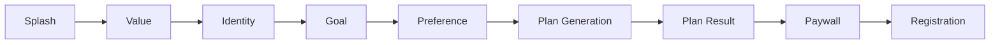

# 健康 App Onboarding 竞品分析报告

## 执行摘要

本报告基于对 **15 个 iOS 健康健身 App** 的 **828 张 Onboarding 截图** 进行的 AI 分析，旨在提取北美市场健康 App 的 Onboarding 最佳实践，为 VitaFlow 的设计提供数据支持的决策依据。

### 关键发现

| 发现 | 数据支持 | 建议行动 |
|------|----------|----------|
| 长问卷策略成为主流 | Noom(114步)、LoseIt(102步)、Yazio(98步) | 采用 40-60 步的中长流程 |
| 付费墙后置是最佳实践 | 80% App 在 85%+ 位置展示付费墙 | 付费墙放在 80-90% 位置 |
| 个性化是核心价值 | 100% App 强调个性化 | 始终强调"为你定制" |
| 单页单问题设计 | 几乎所有 App 采用 | 严格遵守此原则 |
| 7天免费试用最常见 | Noom、MyFitnessPal 等 | 默认提供 7 天试用 |

---

## 1. 研究范围

### 1.1 分析对象

| App 名称 | 类别 | Onboarding 步骤数 |
|----------|------|-------------------|
| Noom | 减重心理 | 114 |
| LoseIt | 卡路里追踪 | 102 |
| Flo | 女性健康 | 100 |
| Yazio | 卡路里&断食 | 98 |
| MyFitnessPal | 营养追踪 | 93 |
| MacroFactor | 宏量营养 | 49 |
| Runna | 跑步训练 | 43 |
| WeightWatchers | 体重管理 | 40 |
| Peloton | 健身课程 | 39 |
| Cal_AI | AI 营养 | 37 |
| Headspace | 冥想 | 33 |
| Strava | 社交健身 | 31 |
| LADDER | 健身训练 | 18 |
| Fitbit | 健身追踪 | 16 |
| Calm | 冥想&睡眠 | 15 |

### 1.2 分析维度

1. **功能目的** (Functional Purpose)
2. **漏斗阶段** (Funnel Stage)
3. **心理策略** (Psychological Tactic)
4. **交互模式** (Interaction Pattern)
5. **UI 模式** (UI Pattern)
6. **承诺梯度** (Commitment Level)

---

## 2. Onboarding 长度分析

### 2.1 长度分布

```
超长 (>100步): ████████████████████ 20% (3个App)
长 (60-100步): █████████████ 13.3% (2个App)
中等 (30-60步): ████████████████████████████████████████ 40% (6个App)
短 (<30步): ██████████████████████████ 26.7% (4个App)
```

### 2.2 长度与收入相关性

**观察**：收入最高的健康 App（Noom、MyFitnessPal、LoseIt）普遍采用**超长 Onboarding** 策略。

**原理**：**承诺一致性** (Commitment & Consistency) —— 用户投入越多时间和信息，越难以放弃，转化意愿越强。

**建议**：VitaFlow 应采用 **40-60 步** 的中长流程，在用户耐心和承诺投入之间取得平衡。

---

## 3. 功能类型覆盖率

### 3.1 必备元素 (Coverage > 80%)

| 功能类型 | 覆盖率 | 典型位置 | 说明 |
|----------|--------|----------|------|
| Value (价值展示) | 100% | 1-10% | Splash、价值主张 |
| Identity (身份采集) | 100% | 10-40% | 性别、年龄、身高、体重 |
| Goal (目标设定) | 100% | 20-50% | 目标方向、目标值、时间线 |
| Plan (计划生成) | 93% | 60-85% | 加载动画、个性化结果 |
| Paywall (付费墙) | 93% | 80-95% | 价格展示、试用offer |

### 3.2 可选元素 (Coverage 50-80%)

| 功能类型 | 覆盖率 | 典型位置 | 说明 |
|----------|--------|----------|------|
| Preference (偏好收集) | 87% | 30-60% | 饮食偏好、运动习惯 |
| Registration (注册) | 80% | 85-100% | 账户创建 |
| Permission (权限) | 73% | 不定 | 通知、健康数据 |

---

## 4. 心理策略分析

### 4.1 使用频率排名

```
Personalization (个性化):     ████████████████████████████████████████████████████ 100%
CommitmentConsistency (承诺一致): ████████████████████████████████████████████ 87%
ProgressAchievement (进度成就):  ████████████████████████████████████████ 80%
Reciprocity (互惠):            ████████████████████████████████████ 73%
LossAversion (损失厌恶):        ████████████████████████████ 53%
Authority (权威):              ██████████████████████████ 47%
SocialProof (社会认同):        ████████████████████ 40%
Scarcity (稀缺性):            █████████████████ 33%
```

### 4.2 最佳实践案例

#### 🎯 Personalization (个性化)

**Noom 减重预测曲线**
- 展示从当前体重到目标体重的个性化预测曲线
- 标注关键里程碑（如度假日期）
- 承诺具体结果："You'll already lose 7 kg by Feb"

**设计要点**：让用户看到"专属于我"的结果，而非通用建议。

#### ⏳ Commitment & Consistency (承诺一致性)

**Noom 114 步超长问卷**
- 渐进式信息收集
- 每页只问一个问题
- 利用沉没成本心理

**设计要点**：用户投入越多，越难放弃。

#### 📊 Progress Achievement (进度成就)

**MyFitnessPal 分段进度条**
- 清晰的步骤分段
- 视觉反馈用户进度
- 小成就激励继续

**设计要点**：让用户知道自己在流程中的位置。

#### 😰 Loss Aversion (损失厌恶)

**Yazio 两选项对比页**
- "Go without Yazio, but miss out on our great features"
- "Let us guide you on your journey"
- 使用 😩 vs 🚀 emoji 强化对比

**设计要点**：强调不行动的损失，而非行动的收益。

---

## 5. 付费墙策略

### 5.1 位置分布

| 位置 | 占比 | App示例 |
|------|------|---------|
| 早期 (<50%) | 7% | Calm |
| 中期 (50-80%) | 13% | Fitbit, Peloton |
| 后期 (>80%) | **80%** | Noom, MyFitnessPal, Yazio, Cal_AI 等 |

### 5.2 付费墙最佳实践

**Noom 付费墙设计要点**：

1. **价值先行**：展示个性化计划内容（而非直接要价格）
2. **免费试用**：7 天免费试用降低决策门槛
3. **取消保证**："Cancel any time in the app" 减少担忧
4. **价格分解**：$159.99/6个月 = $26.67/月 让价格更易接受
5. **紧迫感**："Personalized plan saved: 14:08" 倒计时

---

## 6. 流程结构模式

### 6.1 主流模式 (80% App)

```
Splash → ValueProp → Identity → Goal → Preference → Plan → Paywall → Registration
```

### 6.2 关键流转



---

## 7. 设计假设

基于分析生成的可测试假设：

| ID | 假设 | 证据强度 | 建议行动 |
|----|------|----------|----------|
| H1 | 更长的 Onboarding 带来更高转化 | ⭐⭐⭐⭐ | 测试 40-60步 vs 20-30步 |
| H2 | 付费墙前的价值预览显著提升转化 | ⭐⭐⭐⭐⭐ | 必须在付费墙前展示个性化结果 |
| H3 | Labor Illusion 加载动画增强价值感知 | ⭐⭐⭐⭐ | 使用 3-5秒计算动画 |
| H4 | 每页单问题设计提高完成率 | ⭐⭐⭐⭐⭐ | 严格遵守 |
| H5 | 7天免费试用是最优试用期 | ⭐⭐⭐ | A/B 测试 7天 vs 3天 vs 14天 |

---

## 8. VitaFlow 设计建议

### 8.1 推荐流程结构

**目标步骤数**：50 步（±10）

**推荐顺序**：

1. **Splash** (1步) - 品牌认知
2. **Value Proposition** (2-3步) - 核心价值展示
3. **Goal Selection** (2-3步) - 目标方向选择
4. **Identity Collection** (6-8步) - 身体数据
   - 性别
   - 年龄
   - 身高
   - 当前体重
   - 目标体重
   - 活动水平
5. **Preference Collection** (8-12步) - 偏好设置
   - 饮食偏好
   - 过敏/限制
   - 运动习惯
   - 生活方式
6. **Plan Generation** (2-3步) - 个性化计划生成
   - Loading 动画（Labor Illusion）
   - 结果预览
7. **Value Preview** (3-5步) - 价值展示
   - 个性化预测曲线
   - 里程碑展示
8. **Paywall** (2-3步) - 付费转化
   - 价值提醒
   - 套餐选择
   - 试用 offer
9. **Registration** (2-3步) - 账户创建
10. **Onboarding Complete** (1步) - 首次价值体验

### 8.2 必用心理策略

| 策略 | 实施方式 | 优先级 |
|------|----------|--------|
| Personalization | 所有结果都标注"为你定制" | ⭐⭐⭐⭐⭐ |
| Progress Achievement | 清晰的进度条 | ⭐⭐⭐⭐⭐ |
| Commitment & Consistency | 渐进式信息收集 | ⭐⭐⭐⭐ |
| Reciprocity | 先展示价值再要求付费 | ⭐⭐⭐⭐ |
| Loss Aversion | 付费墙前的价值对比 | ⭐⭐⭐ |

### 8.3 A/B 测试优先级

1. **Onboarding 长度**：40步 vs 60步 vs 80步
2. **付费墙位置**：75% vs 85% vs 95%
3. **试用期长度**：3天 vs 7天 vs 14天
4. **价格展示方式**：月付 vs 年付 vs 分解展示
5. **进度指示方式**：分段 vs 百分比 vs 步骤计数

---

## 9. 下一步行动

### 9.1 立即行动

- [ ] 设计 VitaFlow Onboarding 流程原型
- [ ] 定义 50 步具体内容
- [ ] 设计付费墙页面

### 9.2 短期 (1-2周)

- [ ] 用户测试原型
- [ ] 收集反馈并迭代
- [ ] 准备 A/B 测试框架

### 9.3 中期 (1个月)

- [ ] 发布并开始 A/B 测试
- [ ] 监控转化漏斗数据
- [ ] 持续优化

---

## 附录

### A. 数据文件

- `analysis_queue.json` - 分析队列定义
- `taxonomy_schema.json` - 6维度分类体系
- `comparison_report.json` - 对比分析报告
- `statistics.json` - 统计分析数据

### B. 分析脚本

- `batch_analyze.py` - 批量分析脚本
- `onboarding_analyzer.py` - 分析器主程序

### C. 方法论说明

本分析基于 Claude Opus 4.5 对截图的 AI 视觉分析。由于是静态截图分析，存在以下局限性：

1. **无法获取实际转化数据**
2. **无法识别 A/B 测试变体**
3. **无法评估动画和交互体验**

建议将本报告作为设计参考，最终决策应通过 A/B 测试验证。

---

*报告生成时间：2025-12-22*
*分析工具：Claude Opus 4.5*
*数据来源：15个iOS健康App，828张Onboarding截图*
