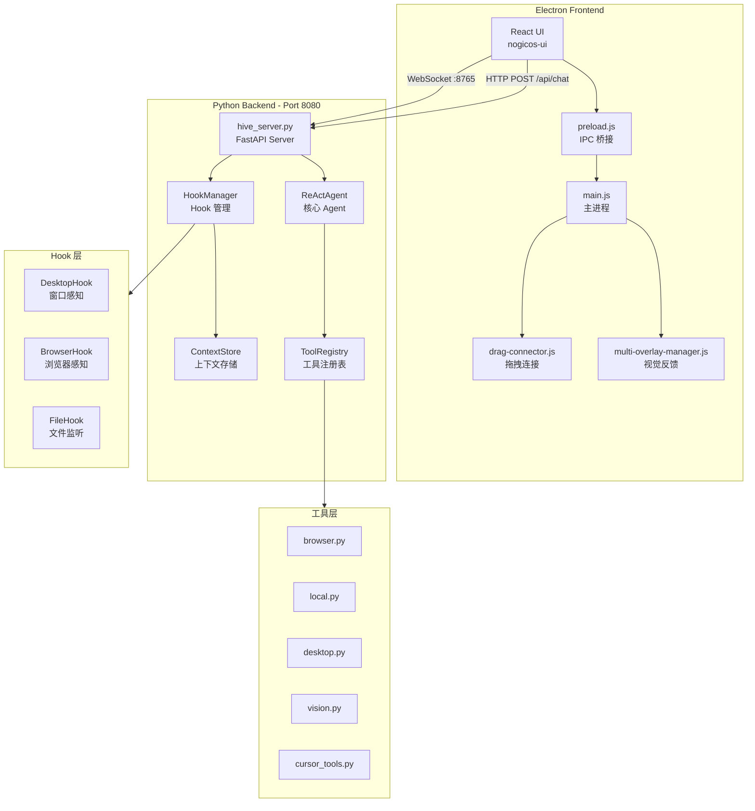

# NogicOS 架构参考文档

> **生成时间**: 2025-01-07
> **基于代码版本**: 扫描现有 `nogicos/` 目录
> **用途**: 后续开发的核心参考，避免与现有架构冲突

---

## 1. 架构总览

### 1.1 系统架构图



### 1.2 核心设计原则

1. **Pure ReAct**: 无预规划，动态决策
2. **Tool-First**: Agent 通过工具执行所有操作
3. **Context-Aware**: Hook 系统提供实时上下文
4. **Streaming**: WebSocket 实时反馈
5. **Local-First**: 本地执行，无云依赖

### 1.3 数据流向

```
用户输入 → /api/chat → ReActAgent.run()
    ↓
Think: LLM 决策 (Claude)
    ↓
Act: ToolRegistry.execute()
    ↓
Observe: 工具结果
    ↓
循环直到完成 → 返回结果
```

---

## 2. ReAct Agent 循环

### 2.1 数据结构

```python
# 源码位置: nogicos/engine/agent/react_agent.py:120-137

@dataclass
class AgentResult:
    """Agent 执行结果"""
    success: bool
    response: str
    error: Optional[str] = None
    iterations: int = 0
    tool_calls: List[Dict[str, Any]] = field(default_factory=list)


@dataclass
class ReflectionResult:
    """反思检查结果（提交答案前的验证）"""
    needs_revision: bool
    feedback: str
    confidence: float = 1.0
    issues: List[str] = field(default_factory=list)
```

### 2.2 ReActAgent 初始化

```python
# 源码位置: nogicos/engine/agent/react_agent.py:684-759

class ReActAgent:
    """
    Pure ReAct Agent - 自主任务执行
    
    特性:
    - 加载用户 Profile 进行个性化
    - 保存执行历史用于学习
    - 注入用户上下文到 prompts
    - Speculative Prompt Caching 减少 TTFT 90%+
    """
    
    # Anthropic Beta 头
    PROMPT_CACHE_BETA = "prompt-caching-2024-07-31"
    THINKING_BETA = "interleaved-thinking-2025-05-14"
    
    def __init__(
        self,
        status_server=None,          # WebSocket 状态服务器
        max_iterations: int = 20,    # 最大迭代次数
        model: str = "claude-opus-4-5-20251101",  # 默认模型
    ):
        # Anthropic 客户端（同步 + 异步）
        self.client = create_anthropic_client()
        self.async_client = create_async_anthropic_client()
        
        # 工具注册表 - 创建一次复用
        self.registry = create_full_registry()
        
        # 知识存储 (B2.1)
        self.knowledge_store = get_store() if KNOWLEDGE_AVAILABLE else None
        
        # 长期记忆存储
        self.memory_store = get_memory_store() if MEMORY_AVAILABLE else None
        self.memory_search = SemanticMemorySearch(self.memory_store) if MEMORY_AVAILABLE else None
        
        # 任务分类器（用于路由）
        self.classifier = TaskClassifier() if CLASSIFIER_AVAILABLE else None
        
        # 任务规划器（复杂任务）- 连接到 registry 获取动态工具
        self.planner = TaskPlanner(model=model, registry=self.registry) if PLANNER_AVAILABLE else None
        
        # 模式路由器 (Agent/Ask/Plan 模式，Cursor 风格)
        self.mode_router = get_mode_router()
        
        # 浏览器连续失败追踪（快速失败机制）
        self._browser_consecutive_failures: int = 0
        self._browser_max_consecutive_failures: int = 2
```

### 2.3 核心方法: run()

```python
# 源码位置: nogicos/engine/agent/react_agent.py (搜索 "async def run")
# 简化版核心逻辑

async def run(
    self,
    task: str,
    session_id: str = "default",
    context: Optional[str] = None,      # 额外上下文
    mode: AgentMode = AgentMode.AGENT,  # 模式
    confirmed_plan: Optional[Plan] = None,
    # 流式回调
    on_text_delta: Optional[Callable] = None,
    on_thinking_delta: Optional[Callable] = None,
    on_tool_start: Optional[Callable] = None,
    on_tool_end: Optional[Callable] = None,
) -> AgentResult:
    """
    执行任务
    
    Args:
        task: 用户任务
        session_id: 会话 ID
        context: 额外上下文（对话历史等）
        mode: Agent 模式 (AGENT/ASK/PLAN)
        confirmed_plan: 已确认的计划（Plan 模式）
        on_*: 流式回调函数
    
    Returns:
        AgentResult
    """
    # 1. 构建 System Prompt（含记忆、历史）
    system_prompt = await self._build_system_prompt_with_memory(session_id, task)
    
    # 2. 准备消息
    messages = [{"role": "user", "content": task}]
    if context:
        messages[0]["content"] = f"{context}\n\n{task}"
    
    # 3. ReAct 循环
    for iteration in range(self.max_iterations):
        # Think: 调用 LLM
        response = await self.async_client.messages.create(
            model=self.model,
            max_tokens=4096,
            system=self._build_cached_system(system_prompt),
            tools=self._build_cached_tools(self.registry.to_anthropic_format()),
            messages=messages,
        )
        
        # 处理响应
        for block in response.content:
            if block.type == "text":
                # 文本输出
                if on_text_delta:
                    await on_text_delta(block.text)
                    
            elif block.type == "tool_use":
                # Act: 执行工具
                tool_name = block.name
                tool_args = block.input
                
                if on_tool_start:
                    await on_tool_start(block.id, tool_name, tool_args)
                
                # 执行工具（带智能重试）
                result = await self._execute_with_retry(tool_name, tool_args)
                
                if on_tool_end:
                    await on_tool_end(block.id, result.success, str(result.output))
                
                # Observe: 将结果添加到消息
                messages.append({"role": "assistant", "content": response.content})
                messages.append({
                    "role": "user",
                    "content": [{
                        "type": "tool_result",
                        "tool_use_id": block.id,
                        "content": str(result.output),
                    }]
                })
        
        # 检查是否完成
        if response.stop_reason == "end_turn":
            break
    
    return AgentResult(success=True, response=final_response, iterations=iteration)
```

### 2.4 智能重试: _execute_with_retry()

```python
# 源码位置: nogicos/engine/agent/react_agent.py:1248-1316

async def _execute_with_retry(
    self,
    tool_name: str,
    args: dict,
    max_retries: int = 2,
):
    """
    智能重试逻辑
    
    根据错误类型选择策略:
    - timeout: 指数退避 (1s, 2s, 4s...)
    - rate_limit: 线性退避 (5s, 10s, 15s...)
    - not_found: 不重试（确定性失败）
    - resource_busy: 中等退避 (2s, 4s, 6s...)
    """
    for attempt in range(max_retries + 1):
        result = await self.registry.execute(tool_name, args)
        
        if result.success:
            return result
        
        # 分类错误
        error_type, is_retryable, suggestion = self._classify_error(result.error)
        
        if not is_retryable:
            break
        
        # 计算退避时间
        if error_type == "timeout":
            backoff = 1.0 * (2 ** attempt)
        elif error_type == "rate_limit":
            backoff = 5.0 * (attempt + 1)
        elif error_type == "resource_busy":
            backoff = 2.0 * (attempt + 1)
        else:
            backoff = 0.5
        
        await asyncio.sleep(backoff)
    
    return result
```

---

## 3. Tool System

### 3.1 数据结构

```python
# 源码位置: nogicos/engine/tools/base.py:40-82

class ToolCategory(str, Enum):
    """工具分类（用于路由和过滤）"""
    BROWSER = "browser"
    LOCAL = "local"
    PLAN = "plan"
    SYSTEM = "system"


@dataclass
class ToolDefinition:
    """工具定义"""
    name: str
    description: str
    input_schema: Dict[str, Any]
    category: ToolCategory
    handler: Callable[..., Awaitable[Any]]
    requires_context: List[str] = field(default_factory=list)  # 如 ['browser_session']
    
    def to_anthropic_format(self) -> Dict[str, Any]:
        """转换为 Anthropic 工具格式"""
        return {
            "name": self.name,
            "description": self.description,
            "input_schema": self.input_schema
        }


@dataclass
class ToolResult:
    """工具执行结果"""
    success: bool
    output: Any
    error: Optional[str] = None
    tool_name: str = ""
    duration_ms: int = 0
```

### 3.2 ToolRegistry 类

```python
# 源码位置: nogicos/engine/tools/base.py:85-240

class ToolRegistry:
    """
    统一工具注册表
    
    支持:
    - Decorator-based 注册 (@registry.action)
    - Category-based 过滤
    - Context 注入 (browser_session, file_system, etc.)
    - Anthropic/LangChain 格式转换
    """
    
    def __init__(self):
        self._tools: Dict[str, ToolDefinition] = {}
        self._context: Dict[str, Any] = {}
    
    def set_context(self, key: str, value: Any) -> None:
        """设置上下文值（会注入到工具）"""
        self._context[key] = value
    
    def action(
        self,
        description: Union[str, "ToolDescription"],
        category: ToolCategory = ToolCategory.SYSTEM,
        requires_context: Optional[List[str]] = None,
    ) -> Callable:
        """
        ========================================
        装饰器：注册工具
        ========================================
        
        用法:
            @registry.action("导航到 URL", category=ToolCategory.BROWSER)
            async def browser_navigate(url: str) -> str:
                ...
        """
        def decorator(func: Callable) -> Callable:
            # 从函数签名提取 input_schema
            sig = signature(func)
            properties = {}
            required = []
            
            for param_name, param in sig.parameters.items():
                if param_name in ('self', 'context', 'browser_session'):
                    continue
                # ... 构建 JSON Schema
            
            # 创建工具定义
            tool_def = ToolDefinition(
                name=func.__name__,
                description=str(description),
                input_schema={"type": "object", "properties": properties, "required": required},
                category=category,
                handler=func,
                requires_context=requires_context or []
            )
            
            self.register(tool_def)
            return func
        
        return decorator
    
    async def execute(
        self,
        name: str,
        args: Dict[str, Any],
        max_retries: int = 3,
        timeout_seconds: float = 30.0,
    ) -> ToolResult:
        """
        执行工具
        
        特性:
        - 自动重试 (max_retries)
        - 超时处理 (timeout_seconds)
        - 优雅降级
        - 友好错误消息
        """
        tool = self._tools.get(name)
        if not tool:
            return ToolResult(success=False, error=f"Tool '{name}' not found")
        
        for attempt in range(max_retries):
            try:
                # 注入上下文
                call_args = dict(args)
                for ctx_key in tool.requires_context:
                    if ctx_key in self._context:
                        call_args[ctx_key] = self._context[ctx_key]
                
                # 执行（带超时）
                result = await asyncio.wait_for(
                    tool.handler(**call_args),
                    timeout=timeout_seconds
                )
                
                return ToolResult(success=True, output=result, tool_name=name)
                
            except asyncio.TimeoutError:
                # ... 重试逻辑
            except Exception as e:
                # ... 重试逻辑
        
        return ToolResult(success=False, error=last_error, tool_name=name)
```

### 3.3 工具注册示例

```python
# 源码位置: nogicos/engine/tools/browser.py:35-52

@registry.action(
    description=BROWSER_NAVIGATE,  # 结构化描述
    category=ToolCategory.BROWSER,
    requires_context=["browser_session"]  # 需要浏览器会话
)
async def browser_navigate(url: str, browser_session=None) -> str:
    """导航到 URL"""
    if browser_session is None:
        return "Error: No browser session available"
    
    try:
        await browser_session.navigate(url)
        title = await browser_session.get_title()
        return f"Navigated to {url}. Page title: {title}"
    except Exception as e:
        return f"Error navigating to {url}: {str(e)}"
```

### 3.4 创建完整注册表

```python
# 源码位置: nogicos/engine/tools/__init__.py:40-60

def create_full_registry() -> ToolRegistry:
    """
    创建完整的工具注册表
    
    Returns:
        包含所有工具的 ToolRegistry
    """
    registry = ToolRegistry()
    register_browser_tools(registry)   # 浏览器工具
    register_local_tools(registry)     # 本地文件工具
    register_cursor_tools(registry)    # Cursor IDE 工具
    
    # 可选：桌面工具（需要 pyautogui）
    if DESKTOP_TOOLS_AVAILABLE:
        register_desktop_tools(registry)
    
    # 可选：视觉工具（需要 anthropic）
    if VISION_TOOLS_AVAILABLE:
        register_vision_tools(registry)
    
    return registry
```

---

## 4. Hook System

### 4.1 数据结构

```python
# 源码位置: nogicos/engine/context/store.py:24-49

class HookType(Enum):
    """Hook 类型"""
    BROWSER = "browser"
    DESKTOP = "desktop"
    FILE = "file"
    APP = "app"  # 通用应用 Hook


class AppType(Enum):
    """应用类型"""
    BROWSER = "browser"
    IDE = "ide"
    DESIGN = "design"
    COMMUNICATION = "communication"
    PRODUCTIVITY = "productivity"
    MEDIA = "media"
    OTHER = "other"


class HookStatus(Enum):
    """连接状态"""
    DISCONNECTED = "disconnected"
    CONNECTING = "connecting"
    CONNECTED = "connected"
    ERROR = "error"
```

### 4.2 Context 数据结构

```python
# 源码位置: nogicos/engine/context/store.py:51-123

@dataclass
class BrowserContext:
    """浏览器上下文"""
    app: str = ""                  # Chrome, Firefox, Edge
    url: str = ""                  # 当前 URL
    title: str = ""                # 页面标题
    window_title: str = ""         # 完整窗口标题（Overlay 匹配用）
    hwnd: int = 0                  # 窗口句柄
    tab_count: int = 0
    tabs: List[Dict[str, str]] = field(default_factory=list)
    last_updated: str = field(default_factory=lambda: datetime.now().isoformat())


@dataclass
class DesktopContext:
    """桌面上下文"""
    hwnd: int = 0                  # 窗口句柄
    active_app: str = ""           # 当前活跃应用（进程名）
    active_window: str = ""        # 当前活跃窗口标题
    window_list: List[Dict[str, str]] = field(default_factory=list)
    last_updated: str = field(default_factory=lambda: datetime.now().isoformat())


@dataclass
class AppContext:
    """
    通用应用上下文（新版统一接口）
    """
    # 基本信息
    hwnd: int = 0
    title: str = ""
    app_name: str = ""             # 进程名（如 chrome.exe）
    app_display_name: str = ""     # 显示名称（如 Google Chrome）
    app_type: str = "other"
    
    # 窗口信息
    x: int = 0
    y: int = 0
    width: int = 0
    height: int = 0
    
    # 浏览器特有
    url: str = ""
    tab_count: int = 0
    
    # IDE 特有
    file_path: str = ""
    project_path: str = ""
    
    def to_dict(self) -> Dict[str, Any]:
        return asdict(self)
```

### 4.3 HookManager

```python
# 源码位置: nogicos/engine/context/hook_manager.py:43-170

@dataclass
class ConnectionTarget:
    """连接目标"""
    type: str           # browser, desktop, file
    target: str = ""    # 具体目标（如 chrome, 目录路径, 或 HWND）
    config: Optional[HookConfig] = None


class HookManager:
    """
    ========================================
    Hook 管理器
    ========================================
    
    统一管理所有 Hook 的生命周期:
    - connect/disconnect
    - 状态同步到 Context Store
    - WebSocket 事件推送
    """
    
    # Hook 类型映射
    HOOK_CLASSES = {
        "browser": BrowserHook,
        "desktop": DesktopHook,
        "file": FileHook,
    }
    
    def __init__(self, context_store: Optional[ContextStore] = None):
        self._store = context_store or get_context_store()
        self._hooks: Dict[str, BaseHook] = {}
        self._lock = asyncio.Lock()
        self._on_state_change: Optional[Callable] = None
    
    async def connect(self, target: ConnectionTarget) -> bool:
        """
        连接到目标
        
        Args:
            target: 连接目标配置
            
        Returns:
            是否成功连接
        """
        async with self._lock:
            hook_id = f"{target.type}_{target.target}" if target.target else target.type
            
            # 检查是否已连接
            if hook_id in self._hooks and self._hooks[hook_id].is_running:
                return True
            
            # 创建 Hook 实例
            hook_class = self.HOOK_CLASSES.get(target.type)
            if not hook_class:
                return False
            
            hook = hook_class(hook_id=hook_id, config=target.config or HookConfig())
            
            # 设置回调
            hook.set_callbacks(
                on_state_change=lambda state: self._handle_state_change(hook_id, state),
                on_context_update=lambda ctx: self._handle_context_update(hook_id, ctx),
            )
            
            # 启动 Hook
            success = await hook.start(target.target)
            
            if success:
                self._hooks[hook_id] = hook
            
            return success
    
    async def disconnect(self, hook_id: str) -> bool:
        """断开连接"""
        async with self._lock:
            if hook_id not in self._hooks:
                return True
            
            hook = self._hooks[hook_id]
            success = await hook.stop()
            
            if success:
                del self._hooks[hook_id]
                self._store.remove_hook(hook_id)
            
            return success
    
    async def connect_to_window(self, hwnd: int, window_title: str = "") -> Optional[AppContext]:
        """
        ========================================
        通用应用连接器（新版接口）
        ========================================
        
        根据应用类型自动选择合适的 Hook 策略
        
        Args:
            hwnd: 窗口句柄
            window_title: 窗口标题
            
        Returns:
            AppContext 或 None
        """
        # 从窗口列表查找窗口信息
        windows = get_all_windows()
        target_window = next((w for w in windows if w.hwnd == hwnd), None)
        
        if not target_window:
            return None
        
        # 确定应用类型和 Hook 类型
        app_name_lower = target_window.app_name.lower()
        if app_name_lower in BROWSER_PROCESSES:
            app_type = AppType.BROWSER.value
            hook_type = "browser"
        elif app_name_lower in ["code.exe", "cursor.exe"]:
            app_type = AppType.IDE.value
            hook_type = "desktop"
        else:
            app_type = AppType.OTHER.value
            hook_type = "desktop"
        
        # 连接
        success = await self.connect(ConnectionTarget(
            type=hook_type,
            target=str(hwnd),  # 传递 HWND
        ))
        
        if not success:
            return None
        
        # 创建 AppContext
        return AppContext(
            hwnd=target_window.hwnd,
            title=target_window.title,
            app_name=target_window.app_name,
            app_display_name=target_window.app_display_name,
            app_type=app_type,
            x=target_window.x,
            y=target_window.y,
            width=target_window.width,
            height=target_window.height,
        )
```

### 4.4 DesktopHook - 窗口枚举

```python
# 源码位置: nogicos/engine/context/hooks/desktop_hook.py:295-398

def get_all_windows() -> List[WindowInfo]:
    """
    ========================================
    获取所有可见窗口
    ========================================
    
    供 /api/windows 端点调用，用于窗口选择器 UI
    
    Returns:
        List[WindowInfo]: 窗口信息列表，按最近活跃排序
    """
    if not WINDOWS_AVAILABLE:
        return []
    
    user32 = ctypes.windll.user32
    windows: List[WindowInfo] = []
    
    def enum_callback(hwnd, _):
        # 只处理可见窗口
        if not user32.IsWindowVisible(hwnd):
            return True
        
        # 获取窗口标题
        length = user32.GetWindowTextLengthW(hwnd)
        if length == 0:
            return True
        
        buffer = ctypes.create_unicode_buffer(length + 1)
        user32.GetWindowTextW(hwnd, buffer, length + 1)
        title = buffer.value
        
        # 获取进程名
        app_name = _get_process_name_static(hwnd)
        
        # 过滤系统窗口和自己的应用
        if _is_system_window_static(title, app_name):
            return True
        
        # 获取窗口位置
        rect = wintypes.RECT()
        user32.GetWindowRect(hwnd, ctypes.byref(rect))
        
        # 过滤太小的窗口
        width = rect.right - rect.left
        height = rect.bottom - rect.top
        if width < 100 or height < 100:
            return True
        
        # 判断是否是浏览器
        is_browser = app_name.lower() in BROWSER_PROCESSES
        app_display_name = APP_DISPLAY_NAMES.get(app_name.lower(), app_name.replace(".exe", "").title())
        
        windows.append(WindowInfo(
            hwnd=hwnd,
            title=title,
            app_name=app_name,
            app_display_name=app_display_name,
            is_browser=is_browser,
            x=rect.left,
            y=rect.top,
            width=width,
            height=height,
        ))
        
        return True
    
    # 枚举窗口
    WNDENUMPROC = ctypes.WINFUNCTYPE(ctypes.c_bool, ctypes.c_int, ctypes.c_int)
    user32.EnumWindows(WNDENUMPROC(enum_callback), 0)
    
    # 前台窗口排最前
    foreground_hwnd = user32.GetForegroundWindow()
    windows.sort(key=lambda w: (w.hwnd != foreground_hwnd, w.app_display_name))
    
    return windows[:30]
```

---

## 5. Context Store

### 5.1 ContextStore 类

```python
# 源码位置: nogicos/engine/context/store.py:157-270

class ContextStore:
    """
    ========================================
    上下文存储
    ========================================
    
    - 当前状态：内存中的实时状态
    - 历史记录：SQLite 持久化
    """
    
    def __init__(self, db_path: Optional[str] = None):
        self._lock = threading.Lock()
        self._hooks: Dict[str, HookState] = {}
        self._listeners: List[Callable] = []
        
        # SQLite 数据库
        if db_path is None:
            db_dir = Path(__file__).parent.parent.parent / "data"
            db_dir.mkdir(parents=True, exist_ok=True)
            db_path = str(db_dir / "context_history.db")
        
        self._db_path = db_path
        self._init_db()
    
    def get_context_for_agent(self) -> Dict[str, Any]:
        """
        ========================================
        获取当前上下文（供 Agent 使用）
        ========================================
        """
        connected = self.get_connected_hooks()
        
        context = {
            "connected_hooks": list(connected.keys()),
            "browser": None,
            "desktop": None,
            "files": None,
        }
        
        for hook_id, state in connected.items():
            if state.type == HookType.BROWSER and state.context:
                context["browser"] = asdict(state.context)
            elif state.type == HookType.DESKTOP and state.context:
                context["desktop"] = asdict(state.context)
            elif state.type == HookType.FILE and state.context:
                context["files"] = asdict(state.context)
        
        return context
    
    def format_context_prompt(self) -> str:
        """
        ========================================
        格式化上下文为 prompt 字符串
        ========================================
        
        输出示例:
        [Current Context - NogicOS is aware of the following:]
        
        ## Browser (Chrome)
        - Active URL: https://example.com
        - Page Title: Example Page
        """
        ctx = self.get_context_for_agent()
        
        if not ctx["connected_hooks"]:
            return ""
        
        lines = ["[Current Context - NogicOS is aware of the following:]"]
        
        if ctx["browser"]:
            b = ctx["browser"]
            lines.append(f"\n## Browser ({b['app']})")
            lines.append(f"- Active URL: {b['url']}")
            lines.append(f"- Page Title: {b['title']}")
        
        if ctx["desktop"]:
            d = ctx["desktop"]
            lines.append(f"\n## Desktop")
            lines.append(f"- Active App: {d['active_app']}")
            lines.append(f"- Active Window: {d['active_window']}")
        
        return "\n".join(lines)
```

---

## 6. Electron Client

### 6.1 main.js - 主进程

```javascript
// 源码位置: nogicos/client/main.js

/**
 * NogicOS Desktop Client
 * 
 * 特性:
 * - 全局快捷键唤醒 (Alt+N)
 * - 系统托盘
 * - 单实例锁定
 * - 窗口状态记忆
 */

const { app, BrowserWindow, ipcMain, globalShortcut, Tray } = require('electron');

// 模块加载
let multiOverlayManager = require('./multi-overlay-manager');
let dragConnector = require('./drag-connector');

// 配置
const DEV_SERVER_URL = 'http://localhost:5173';
const IS_DEV = process.env.NODE_ENV === 'development' || !app.isPackaged;

// 单实例锁定
const gotLock = app.requestSingleInstanceLock();
if (!gotLock) {
  app.quit();
}

// 全局快捷键
function registerGlobalShortcuts() {
  // Alt+N: 唤醒/隐藏窗口
  globalShortcut.register('Alt+N', () => {
    if (mainWindow.isVisible() && mainWindow.isFocused()) {
      mainWindow.hide();
    } else {
      mainWindow.show();
      mainWindow.focus();
    }
  });
}

// IPC 处理 - Overlay 连接
ipcMain.handle('overlay:show-connection', async (event, { hookType, target, targetHwnd }) => {
  // 调用 MultiOverlayManager 显示 Overlay
  if (multiOverlayManager) {
    const result = multiOverlayManager.createOverlay(targetHwnd);
    if (result.success) {
      multiOverlayManager.startTracking(targetHwnd);
    }
    return result;
  }
  return { success: false };
});

ipcMain.handle('overlay:hide-connection', async (event, { hookType }) => {
  if (multiOverlayManager) {
    multiOverlayManager.destroyAll();
  }
  return { success: true };
});

// 应用生命周期
app.whenReady().then(() => {
  createWindow();
  createTray();
  registerGlobalShortcuts();
  
  // 注册 IPC 处理器
  if (dragConnector) {
    dragConnector.setupDragConnectorIPC(mainWindow);
  }
  if (multiOverlayManager) {
    multiOverlayManager.setupMultiOverlayIPC();
  }
});
```

### 6.2 preload.js - IPC 桥接

```javascript
// 源码位置: nogicos/client/preload.js

const { contextBridge, ipcRenderer } = require('electron');

contextBridge.exposeInMainWorld('electronAPI', {
  // 窗口控制
  minimizeWindow: () => ipcRenderer.send('window-minimize'),
  maximizeWindow: () => ipcRenderer.send('window-maximize'),
  closeWindow: () => ipcRenderer.send('window-close'),
  
  // Overlay 控制
  showConnectionOverlay: (data) => ipcRenderer.invoke('overlay:show-connection', data),
  hideConnectionOverlay: (data) => ipcRenderer.invoke('overlay:hide-connection', data),
  
  // 拖拽连接器
  startDragConnector: () => ipcRenderer.invoke('drag-connector:start'),
  onDragConnectorComplete: (callback) => {
    const handler = (event, data) => callback(data);
    ipcRenderer.on('drag-connector:complete', handler);
    return () => ipcRenderer.removeListener('drag-connector:complete', handler);
  },
  
  // Multi-Overlay API
  createOverlay: (hwnd) => ipcRenderer.invoke('multi-overlay:create', hwnd),
  destroyOverlay: (hwnd) => ipcRenderer.invoke('multi-overlay:destroy', hwnd),
  startTracking: (hwnd) => ipcRenderer.invoke('multi-overlay:startTracking', hwnd),
  stopTracking: (hwnd) => ipcRenderer.invoke('multi-overlay:stopTracking', hwnd),
});
```

### 6.3 multi-overlay-manager.js 核心

```javascript
// 源码位置: nogicos/client/multi-overlay-manager.js

/**
 * NogicOS Multi-Overlay Manager
 * 
 * 纯 Electron + koffi 实现，支持多窗口同时管理
 */

const { BrowserWindow, screen, ipcMain } = require('electron');
const koffi = require('koffi');

// Windows API 绑定
const user32 = koffi.load('user32.dll');
const GetWindowRect = user32.func('GetWindowRect', 'bool', ['void*', koffi.out(koffi.pointer(RECT))]);
const IsIconic = user32.func('IsIconic', 'bool', ['void*']);
const IsWindowVisible = user32.func('IsWindowVisible', 'bool', ['void*']);
const GetForegroundWindow = user32.func('GetForegroundWindow', 'long', []);

// 轮询间隔 (~120fps)
const POLL_INTERVAL_MS = 8;

/**
 * 检查窗口完整状态
 */
function getWindowState(hwnd) {
  return {
    isMinimized: IsIconic(hwnd),
    isVisible: IsWindowVisible(hwnd),
    isForeground: GetForegroundWindow() === hwnd,
    shouldShowOverlay: /* 综合判断 */,
  };
}

/**
 * 多窗口 Overlay 管理器
 */
class MultiOverlayManager {
  constructor() {
    this._overlays = new Map();  // hwnd -> OverlayInstance
  }
  
  createOverlay(hwnd) {
    // 创建透明、置顶、不可聚焦的窗口
    const overlayWindow = new BrowserWindow({
      transparent: true,
      frame: false,
      alwaysOnTop: true,
      skipTaskbar: true,
      focusable: false,
      type: 'toolbar',  // Windows: 非焦点窗口
    });
    
    overlayWindow.setIgnoreMouseEvents(true);
    overlayWindow.loadURL(`data:text/html,...`);  // Overlay HTML
    
    this._overlays.set(hwnd, { window: overlayWindow, ... });
  }
  
  startTracking(hwnd) {
    // 开始轮询目标窗口位置
    const instance = this._overlays.get(hwnd);
    instance.pollInterval = setInterval(() => {
      this._syncPosition(instance);
    }, POLL_INTERVAL_MS);
  }
  
  _syncPosition(instance) {
    const state = getWindowState(instance.hwnd);
    
    if (!state.shouldShowOverlay) {
      instance.window.hide();
      return;
    }
    
    // 获取窗口位置并同步
    const bounds = getWindowBounds(instance.hwnd);
    
    // DPI 转换
    const display = screen.getDisplayNearestPoint({ x: bounds.x, y: bounds.y });
    const scaleFactor = display.scaleFactor || 1;
    
    instance.window.setBounds({
      x: Math.round(bounds.x / scaleFactor),
      y: Math.round(bounds.y / scaleFactor),
      width: Math.round(bounds.width / scaleFactor),
      height: Math.round(bounds.height / scaleFactor),
    });
    
    instance.window.showInactive();
  }
}
```

---

## 7. NogicOS 适配指南

### 7.1 如何添加新工具

```python
# 1. 在 nogicos/engine/tools/ 创建新文件或添加到现有文件

from .base import ToolRegistry, ToolCategory

def register_my_tools(registry: ToolRegistry) -> ToolRegistry:
    
    @registry.action(
        description="我的新工具描述",
        category=ToolCategory.LOCAL,  # 选择合适的分类
    )
    async def my_new_tool(param1: str, param2: int = 10) -> str:
        """工具实现"""
        # ... 实现逻辑
        return "结果"
    
    return registry

# 2. 在 nogicos/engine/tools/__init__.py 中导入并注册
def create_full_registry() -> ToolRegistry:
    registry = ToolRegistry()
    # ... 现有工具
    register_my_tools(registry)  # 添加这行
    return registry
```

### 7.2 如何添加新 Hook

```python
# 1. 在 nogicos/engine/context/hooks/ 创建新文件

from .base_hook import BaseHook, HookConfig
from ..store import HookType

class MyNewHook(BaseHook):
    def __init__(self, hook_id: str, config: Optional[HookConfig] = None):
        super().__init__(hook_id, HookType.APP, config)  # 选择合适的类型
    
    async def _connect(self, target: Optional[str] = None) -> bool:
        """连接逻辑"""
        return True
    
    async def _disconnect(self) -> bool:
        """断开逻辑"""
        return True
    
    async def capture(self) -> Optional[MyContext]:
        """捕获上下文"""
        return MyContext(...)

# 2. 在 HookManager 中注册
class HookManager:
    HOOK_CLASSES = {
        "browser": BrowserHook,
        "desktop": DesktopHook,
        "file": FileHook,
        "my_hook": MyNewHook,  # 添加这行
    }
```

### 7.3 扩展 Agent 循环的注意事项

1. **不要修改核心循环逻辑**: `run()` 和 `_execute_with_retry()` 是稳定的
2. **通过工具扩展能力**: 新功能应该作为工具添加，而不是修改 Agent
3. **利用 Context Injection**: 使用 `requires_context` 自动注入依赖
4. **保持向后兼容**: 新参数应该有默认值

---

## 8. 已知问题 / 技术债务

| 问题 | 位置 | 状态 |
|------|------|------|
| 调试日志残留 | `desktop_hook.py` | 待清理 |
| 废弃代码 | `overlay-controller.js` | 可删除 |
| 文档滞后 | `ARCHITECTURE.md` | 需更新 |

---

## 9. 快速参考表

| 功能 | 文件 | 关键方法/类 |
|------|------|-------------|
| Agent 循环 | `react_agent.py` | `ReActAgent.run()` |
| 工具注册 | `tools/base.py` | `@registry.action` |
| 工具执行 | `tools/base.py` | `ToolRegistry.execute()` |
| Hook 连接 | `hook_manager.py` | `HookManager.connect()` |
| 窗口枚举 | `desktop_hook.py` | `get_all_windows()` |
| 上下文格式化 | `store.py` | `format_context_prompt()` |
| Overlay 创建 | `multi-overlay-manager.js` | `createOverlay()` |
| IPC 暴露 | `preload.js` | `contextBridge.exposeInMainWorld` |
